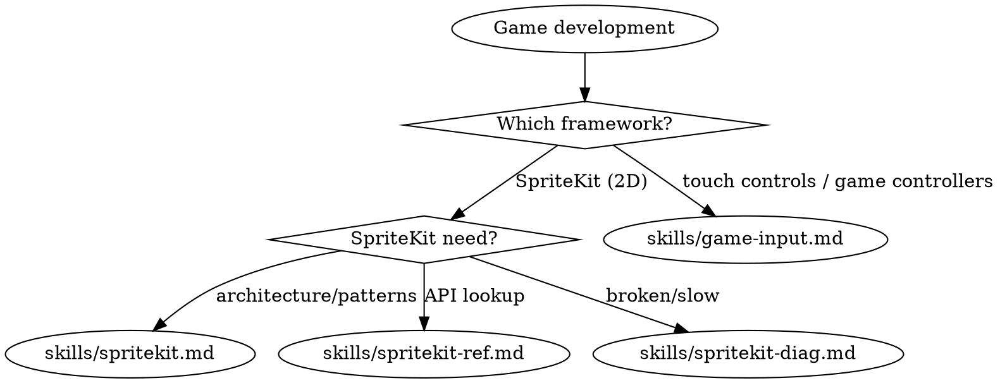

<!-- Source: CharlesWiltgen/Axiom axiom-codex/skills/axiom-games. License: MIT. Paired with tested game-spritekit-concurrent reference from the 2026-06-17 Chorus iOS skill eval. Marketplace frontmatter adjusted; upstream guidance preserved. -->

# Games

Before writing SpriteKit contact code under Swift 6, read `references/game-spritekit-concurrent.md`. The tested iOS game path needs the SpriteKit patterns plus the isolated `SKPhysicsContactDelegate` conformance described there.

**You MUST use this skill for ANY game development, SpriteKit, SceneKit, RealityKit, touch controls, game controller, or interactive simulation work.**

## Quick Reference

| Symptom / Task | Reference |
|----------------|-----------|
| Building a SpriteKit game | See `skills/spritekit.md` |
| Adding touch controls to a game (TouchController) | See `skills/game-input.md` |
| Game controller input (GCController, polling vs handlers) | See `skills/game-input.md` |
| Controller Home button settings, spatial accessories `OS27` | See `skills/game-input.md` |
| SpriteKit API lookup | See `skills/spritekit-ref.md` |
| Physics contacts not firing | See `skills/spritekit-diag.md` |
| Frame rate drops (SpriteKit) | See `skills/spritekit-diag.md` |
| Touches not registering | See `skills/spritekit-diag.md` |
| Memory spikes in gameplay | See `skills/spritekit-diag.md` |
| Coordinate confusion | See `skills/spritekit-diag.md` |
| Scene transition crashes | See `skills/spritekit-diag.md` |
| Objects tunneling through walls | See `skills/spritekit-diag.md` |
| SpriteKit node/action reference | See `skills/spritekit-ref.md` |

## Decision Tree

1. Building/designing a 2D SpriteKit game? -> `skills/spritekit.md`
2. How to use a specific SpriteKit API? -> `skills/spritekit-ref.md`
3. SpriteKit broken or performing badly? -> `skills/spritekit-diag.md`
4. Adding touch controls, or handling game controller input? -> `skills/game-input.md`

Scores: PERFORMANT / DEGRADED / UNPLAYABLE

## Critical Patterns

**SpriteKit** (`skills/spritekit.md`):
- PhysicsCategory struct with explicit bitmasks (default `0xFFFFFFFF` causes phantom collisions)
- Camera node pattern for viewport + HUD separation
- SKShapeNode pre-render-to-texture conversion
- `[weak self]` in all `SKAction.run` closures
- Delta time with spiral-of-death clamping

**SpriteKit diagnostics** (`skills/spritekit-diag.md`):
- 5-step bitmask checklist (2 min vs 30-120 min guessing)
- Debug overlays as mandatory first diagnostic step
- Tunneling prevention flowchart
- Memory growth diagnosis via `showsNodeCount` trending

**Game input** (`skills/game-input.md`):
- One GCController pipeline  -  touch controls surface as a `GCController`, existing logic unchanged
- `TCTouchController.isSupported` gate + connect/render/touch-routing setup
- Half-screen collider shapes for movement and camera (never small circles)
- Safe-area-adjusted anchor offsets for fullscreen games
- Controller Home button settings + visionOS spatial accessories `OS27`

## Anti-Rationalization

| Thought | Reality |
|---------|---------|
| "SpriteKit is simple, I don't need a skill" | Physics bitmasks default to 0xFFFFFFFF and cause phantom collisions. The bitmask checklist catches this in 2 min. |
| "I'll just use SKShapeNode, it's quick" | Each SKShapeNode is a separate draw call. 50 of them = 50 draw calls. spritekit.md has the pre-render-to-texture pattern. |
| "I can figure out the coordinate system" | SpriteKit uses bottom-left origin (opposite of UIKit). Anchor points add another layer. spritekit-diag.md Symptom 6 resolves in 5 min. |
| "Physics is straightforward" | Three different bitmask properties, modification rules inside callbacks, and tunneling edge cases. spritekit.md Section 3 covers all gotchas. |
| "The performance is fine on my device" | Performance varies dramatically across devices. spritekit.md Section 6 has the debug overlay checklist. |
| "I'll overlay UIButtons for touch controls" | TouchController renders in your Metal pass and surfaces as a GCController  -  existing controller logic just works. UIButton overlays mean a second input path and per-frame UIKit cost. game-input.md Section 2. |
| "Touch controls = put every controller button on screen" | A 1:1 mapping clutters the play area and demands 3+ fingers. game-input.md Section 5 has the redesign patterns (context icons, hide unused, collapse combos). |

## Example Invocations

User: "I'm building a SpriteKit game"
-> See `skills/spritekit.md`

User: "My physics contacts aren't firing"
-> See `skills/spritekit-diag.md`

User: "How do I create a physics body from a texture?"
-> See `skills/spritekit-ref.md`

User: "Frame rate is dropping in my game"
-> See `skills/spritekit-diag.md`

User: "What action types are available?"
-> See `skills/spritekit-ref.md`

User: "Objects pass through walls"
-> See `skills/spritekit-diag.md`

User: "I'm porting my controller game to iPhone and need touch controls"
-> See `skills/game-input.md`

User: "How do I handle game controller input?"
-> See `skills/game-input.md`

User: "How do I read spatial accessory input on visionOS?"
-> See `skills/game-input.md`

