<!-- Source: CharlesWiltgen/Axiom axiom-codex/skills/axiom-swiftui. License: MIT. Axiom selected over twostraws SwiftUI-Agent-Skill because this branch needs build/fix implementation guidance, not only review guidance. Marketplace frontmatter adjusted; upstream guidance preserved. -->

# SwiftUI

**You MUST use this skill for ANY SwiftUI work including views, state, navigation, layout, animations, architecture, gestures, and debugging.**

## Quick Reference

| Symptom / Task | Reference |
|----------------|-----------|
| View not updating | See `skills/debugging.md` |
| View update still broken after debugging | See `skills/debugging-diag.md` |
| Slow previews / building good previews / `@Previewable` / `PreviewModifier` / variant matrix | See `skills/previews.md` |
| Preview API reference (`#Preview`, traits, modes, Development Assets) | See `skills/previews-ref.md` |
| Preview crashes / won't load | See `skills/debugging.md` (Preview Crashes section) |
| Navigation issues | See `skills/nav.md` |
| Navigation still broken after debugging | See `skills/nav-diag.md` |
| Navigation API reference | See `skills/nav-ref.md` |
| Layout breaks on iPad/rotation | See `skills/layout.md` |
| Layout API reference | See `skills/layout-ref.md` |
| Performance/lag/slow scroll | See `skills/swiftui-performance.md` |
| Architecture/testability | See `skills/architecture.md` |
| Animation issues | See `skills/animation-ref.md` |
| Stacks/grids/outlines | See `skills/containers-ref.md` |
| Custom containers / List replacement (iOS 18+) | See `skills/containers-ref.md` Part 7 |
| Search implementation | See `skills/search-ref.md` |
| Toolbars, ToolbarItem, sheet button placement, customization | See `skills/toolbars.md` |
| Gesture conflicts | See `skills/gestures.md` |
| iOS 26 features | See `skills/26-ref.md` |

## Decision Tree

```dot
digraph swiftui {
    start [label="SwiftUI issue" shape=ellipse];
    what [label="What's wrong?" shape=diamond];

    start -> what;
    what -> "skills/debugging.md" [label="view not updating"];
    what -> "skills/nav.md" [label="navigation"];
    what -> "skills/swiftui-performance.md" [label="slow/lag"];
    what -> "skills/layout.md" [label="adaptive layout"];
    what -> "skills/containers-ref.md" [label="stacks/grids/outlines"];
    what -> "skills/architecture.md" [label="feature architecture"];
    what -> "skills/animation-ref.md" [label="animations"];
    what -> "skills/gestures.md" [label="gestures"];
    what -> "skills/search-ref.md" [label="search"];
    what -> "skills/toolbars.md" [label="toolbars / sheet buttons"];
    what -> "skills/26-ref.md" [label="iOS 26 features"];
    what -> "skills/previews.md" [label="slow previews / building good previews"];
    what -> "skills/previews-ref.md" [label="preview API reference"];
    what -> "skills/debugging.md" [label="preview crashes / won't load"];
}
```

## Automated Scanning

- Architecture audit -> Launch `swiftui-architecture-auditor` agent
- Performance scan -> Launch `swiftui-performance-analyzer` agent
- Navigation audit -> Launch `swiftui-nav-auditor` agent
- Layout audit -> Launch `swiftui-layout-auditor` agent
- UX flow audit -> Launch `ux-flow-auditor` agent
- Liquid Glass scan -> Launch `liquid-glass-auditor` agent (detects migration opportunities AND adoption-completeness gaps: variant discipline for media surfaces, glass-on-glass nesting, missing `if #available` gates, primary-action tinting, `.tabRole(.search)`; scores ADOPTED / PARTIAL / NOT ADOPTED)
- TextKit scan -> Launch `textkit-auditor` agent (detects fallback triggers, glyph APIs that corrupt complex scripts, missing Writing Tools wiring, AND architectural gaps like missing fallback observation, SwiftUI wrappers dropping TextKit 2 properties, missing `isWritingToolsActive` guards; scores MODERN / MIXED / LEGACY)

## Anti-Rationalization

| Thought | Reality |
|---------|---------|
| "Simple SwiftUI layout, no need" | SwiftUI layout has 12 gotchas. `skills/layout.md` covers all of them. |
| "I know how NavigationStack works" | Navigation has state restoration, deep linking, and identity traps. `skills/nav.md` prevents 2-hour debugging. |
| "It's just a view not updating" | View update failures have 4 root causes. `skills/debugging.md` diagnoses in 5 min. |
| "I'll just add .animation()" | Animation issues compound. `skills/animation-ref.md` has the correct patterns. |
| "No architecture needed" | Even small features benefit from separation. `skills/architecture.md` prevents refactoring debt. |
| "I know .searchable" | Search has 6 gotchas. `skills/search-ref.md` covers all of them. |
| "I'll just add a Done button" | Sheets without Cancel break the HIG (updated 2026-03-24). `.cancellationAction` / `.confirmationAction` produce HIG-correct placement automatically  -  `skills/toolbars.md` Pattern 2 has the rules. |
| "Previews are slow forever, I'll just use the simulator" | Five concrete fixes in `skills/previews.md`. Rule 4 (auto-refresh off) is 30 seconds and often halves perceived slowness. |
| "I'll just write a wrapper view for `@State` in this preview" | `@Previewable @State` (Xcode 16+) eliminates that boilerplate. `skills/previews-ref.md` has the macro signature. |
