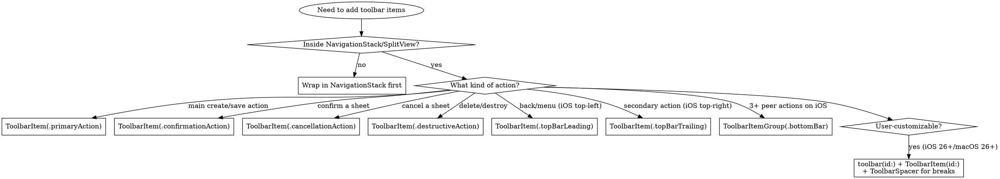

# SwiftUI Toolbars

## When to Use This Skill

Use when:
- Adding action buttons to a navigation bar, bottom bar, or window toolbar
- Choosing between `ToolbarItem`, `ToolbarItemGroup`, and `ToolbarSpacer`
- Selecting the right `ToolbarItemPlacement` for an action
- Building a customizable toolbar (user can rearrange items)
- Setting toolbar visibility, background, or color scheme
- Adopting iOS 26+ `ToolbarSpacer` for visual breaks
- Migrating from deprecated `.navigationBarLeading` / `.navigationBarTrailing`
- Debugging missing or misplaced toolbar items
- Requesting code review of toolbar implementation before shipping

#### Related Skills
- Use `skills/nav.md` for the surrounding NavigationStack/NavigationSplitView the toolbar attaches to
- Use Apple HIG and Apple developer documentation for macOS `windowToolbarStyle` and window-toolbar interactions
- Use Apple developer documentation for menu bar commands and keyboard shortcuts
- Use Apple HIG for iOS 26 toolbar Liquid Glass styling

## Example Prompts

#### 1. "How do I add a Save button to my navigation bar?"
-> The skill shows `.toolbar { ToolbarItem(placement: .primaryAction) { ... } }` and explains why `.primaryAction` is preferred over `.topBarTrailing` for cross-platform behavior.

#### 2. "My toolbar items aren't showing up."
-> The skill covers the most common cause: `.toolbar` must be inside a navigation container (NavigationStack, NavigationSplitView, or sheet's nav). Standalone Views ignore `.toolbar`.

#### 3. "Should I use ToolbarItem or ToolbarItemGroup?"
-> Decision tree: ToolbarItemGroup for tightly-related actions sharing one placement; separate ToolbarItems when you want independent placements or per-item visibility logic.

#### 4. "How do I make my toolbar customizable so users can rearrange items?"
-> Pattern using `.toolbar(id: "...")` + `customizationBehavior` + `ToolbarSpacer(.flexible)` for iOS 26 / iPadOS 26 / macOS 26.

#### 5. "I'm getting a deprecation warning on .navigationBarLeading."
-> Replace with `.topBarLeading` (iOS 14+, but renamed in later versions for cross-platform clarity). Same for `.navigationBarTrailing` -> `.topBarTrailing`.

---

## Red Flags  -  Anti-Patterns to Prevent

| Symptom | Cause | Fix |
|---|---|---|
| Toolbar items don't appear | `.toolbar` on a View not inside NavigationStack/SplitView | Move `.toolbar` to the navigation container's content, or wrap in `NavigationStack` |
| Items appear in wrong order on iPad | Used `.navigationBarTrailing` (deprecated alias) | Use `.topBarTrailing` |
| Customization sheet has nothing to customize | Used `.toolbar { }` instead of `.toolbar(id:)` | Switch to `.toolbar(id:)` and give each `ToolbarItem` an `id:` |
| Spacer between items disappears when toolbar overflows | Used `Spacer()` instead of `ToolbarSpacer` | Use `ToolbarSpacer(.fixed)` or `ToolbarSpacer(.flexible)` (iOS 26+) |
| Two `.primaryAction` items but only one shows | iOS HIG: one primary action per surface | Demote one to `.secondaryAction` or `.topBarTrailing` |
| Toolbar items flicker when state changes | Conditional `if` inside `.toolbar` rebuilds the whole toolbar | Use `.disabled()` / `.opacity()` modifiers on stable items instead |
| Bottom bar doesn't appear on iOS | `.bottomBar` requires `.toolbar(.visible, for: .bottomBar)` or items present | Verify visibility AND content; bottom bar hides when empty |
| Toolbar background ignores custom material | Set `.background` on a child View | Use `.toolbarBackground(.regularMaterial, for: .navigationBar)` instead |
| Search field shoved into a `ToolbarItem` (a `TextField` in the bar) | Search is not toolbar content | Use `.searchable` on the nav container  -  see Pattern 10 |
| Customizable item looks broken in the Edit Toolbar sheet | Text-only or icon-only `Button` | Give every customizable item a `Label` (text + SF Symbol)  -  see Pattern 6 |

---

## Quick Decision Tree



---

## Pattern 1: Basic Toolbar with Primary Action

The most common case  -  a single Save / Done / Add button.

```swift
NavigationStack {
    Form {
        TextField("Title", text: $title)
    }
    .navigationTitle("New Task")
    .toolbar {
        ToolbarItem(placement: .primaryAction) {
            Button("Save") { save() }
                .disabled(title.isEmpty)
        }
    }
}
```

**Why `.primaryAction`** Cross-platform  -  appears top-trailing on iOS, primary toolbar slot on macOS, principal area on watchOS. Avoids platform branching.

---

## Pattern 2: Confirmation / Cancellation in a Sheet

Standard pair for modal sheets. iOS uses these placements specifically  -  they get bolded styling and the right keyboard hookups.

```swift
.sheet(isPresented: $showingEditor) {
    NavigationStack {
        EditorView(item: $editing)
            .toolbar {
                ToolbarItem(placement: .cancellationAction) {
                    Button("Cancel") { showingEditor = false }
                }
                ToolbarItem(placement: .confirmationAction) {
                    Button("Done") {
                        commit(editing)
                        showingEditor = false
                    }
                    .disabled(!editing.isValid)
                }
            }
    }
}
```

**Gotcha** Don't use `.topBarLeading` / `.topBarTrailing` here  -  you lose the platform-correct emphasis (bolded "Done" on iOS, default-button styling on macOS).

### HIG rules for sheet buttons

Apple's HIG codified the following rules for sheet button placement (updated 2026-03-24):

| Rule | Why |
|------|-----|
| Always pair a confirmation button with Cancel or Back | A solo Done implies completing the task is the only way out  -  feels restrictive or misleading. |
| Don't show Cancel, Done, and Back together | Too many dismiss/commit affordances confuse the exit path. Pick the pair the step needs. |
| iOS / iPadOS: Cancel leading, Done trailing | `.cancellationAction` and `.confirmationAction` produce this automatically  -  don't override with `.topBarLeading` / `.topBarTrailing`. |
| watchOS: prefer SF Symbols for action labels | Brief glance-and-tap interactions; text labels read poorly at watch sizes. |

**Practical implication** The pattern above is already correct for iOS/iPadOS/macOS. The rule to internalize is *don't ship a sheet with only a Done button*  -  either add Cancel, or use a Back button if the sheet is mid-flow.

---

## Pattern 3: Multiple Independent Items (separate ToolbarItems)

Use separate `ToolbarItem`s when each needs different placement or independent visibility logic.

```swift
.toolbar {
    ToolbarItem(placement: .topBarLeading) {
        Button { showFilters.toggle() } label: {
            Label("Filter", systemImage: "line.3.horizontal.decrease.circle")
        }
    }
    ToolbarItem(placement: .principal) {
        Picker("View", selection: $sortMode) {
            Text("Date").tag(SortMode.date)
            Text("Name").tag(SortMode.name)
        }
        .pickerStyle(.segmented)
    }
    ToolbarItem(placement: .primaryAction) {
        Button { create() } label: {
            Image(systemName: "plus")
        }
    }
}
```

---

## Pattern 4: Grouped Items (ToolbarItemGroup)

Use `ToolbarItemGroup` when 2+ items share placement AND should be treated as a unit (e.g., they appear/disappear together, share customization behavior).

```swift
.toolbar {
    ToolbarItemGroup(placement: .bottomBar) {
        Button { share() } label: { Image(systemName: "square.and.arrow.up") }
        Spacer()
        Button { archive() } label: { Image(systemName: "archivebox") }
        Spacer()
        Button { delete() } label: { Image(systemName: "trash") }
            .tint(.red)
    }
}
```

**Note** Inside a `ToolbarItemGroup`, regular `Spacer()` works for layout. Outside the group (between separate ToolbarItems), use `ToolbarSpacer` instead  -  see Pattern 5.

---

## Pattern 5: Visual Breaks with ToolbarSpacer (iOS 26+ / macOS 26+)

`ToolbarSpacer` creates visual gaps between separate `ToolbarItem`s and integrates with the customization system. Two variants: `.fixed` (consistent gap) and `.flexible` (expands).

```swift
.toolbar(id: "main") {
    ToolbarItem(id: "tag", placement: .primaryAction) {
        TagButton()
    }
    ToolbarSpacer(.fixed)
    ToolbarItem(id: "share", placement: .primaryAction) {
        ShareButton()
    }
    ToolbarSpacer(.flexible)
    ToolbarItem(id: "more", placement: .primaryAction) {
        MoreButton()
    }
}
```

**Why not regular Spacer** A `Spacer()` between separate `ToolbarItem`s is ignored  -  toolbar layout doesn't honor SwiftUI flex spacing the way an HStack does. `ToolbarSpacer` is the toolbar-aware equivalent and is also customizable (users can add/remove instances).

**Pre-iOS 26 fallback** Group items into `ToolbarItemGroup` and use regular `Spacer()` inside the group.

---

## Pattern 6: Customizable Toolbars (`.toolbar(id:)`)

Lets users rearrange, add, and remove toolbar items via a customization sheet. Requires unique `id:` on the toolbar AND every item.

```swift
.toolbar(id: "browser") {
    ToolbarItem(id: "back", placement: .navigation) {
        Button { goBack() } label: { Image(systemName: "chevron.left") }
    }
    .customizationBehavior(.disabled)  // Always present, not removable
    
    ToolbarItem(id: "share", placement: .secondaryAction) {
        ShareLink(item: currentURL)
    }
    
    ToolbarItem(id: "bookmarks", placement: .secondaryAction) {
        Button { showBookmarks() } label: { Image(systemName: "book") }
    }
    .defaultCustomization(.hidden)  // Available but hidden by default
}
```

**Customization behaviors:**
- `.default`  -  user can move, hide, show
- `.disabled`  -  locked in place
- `.reorderable`  -  can be moved but not hidden

**Where customization appears**
- iPadOS 16+ / macOS 13+: Edit Toolbar menu
- iOS 26+: customization sheet via `.toolbarCustomizationBehavior` action

**Give every customizable item a `Label` (text + SF Symbol), not a text-only or icon-only `Button`**  -  the customization sheet and overflow menu render the label, and a bare title or lone glyph reads as broken there.

**Customization affordance is strongest on iPadOS / macOS.** On iPhone the system reordering UI is limited; if "long-press to rearrange/hide" is a hard iPhone requirement, drive a `ForEach` of toolbar items from a persisted order array instead of relying on `.toolbar(id:)` alone.

---

## Pattern 7: ToolbarRole for Three-Column Layouts

`.toolbarRole(.editor)` reorganizes toolbar items for editor-style apps (Mail, Notes)  -  moves items into the document area's toolbar instead of the sidebar's.

```swift
NavigationSplitView {
    SidebarView()
} content: {
    ListView()
} detail: {
    EditorView()
        .toolbar { editorActions }
        .toolbarRole(.editor)  // Items attach to detail column on iPad/Mac
}
```

Without `.toolbarRole(.editor)`, the items appear in the leftmost visible column  -  usually wrong for editor apps.

---

## Pattern 8: Visibility, Background, Color Scheme

Control toolbar appearance per-bar. The `for:` parameter targets a specific bar (`.navigationBar`, `.bottomBar`, `.tabBar`).

```swift
ContentView()
    // Show or hide a bar
    .toolbar(.visible, for: .bottomBar)
    .toolbar(.hidden, for: .navigationBar)
    
    // Background material/color
    .toolbarBackground(.regularMaterial, for: .navigationBar)
    .toolbarBackground(.visible, for: .navigationBar)
    
    // Color scheme (e.g., dark toolbar on light app)
    .toolbarColorScheme(.dark, for: .navigationBar)
```

**iOS 26 note** Liquid Glass changes how toolbar backgrounds render. Review Apple HIG Liquid Glass guidance before customizing background materials in iOS 26+ apps.

---

## Pattern 9: macOS-Specific  -  windowToolbarStyle

On macOS, the toolbar attaches to a window. The window's toolbar style (`unified`, `expanded`, `unifiedCompact`) is set on the Scene, not the View.

```swift
WindowGroup {
    ContentView()
}
.windowToolbarStyle(.unified)  // Title and toolbar inline (default for many apps)
```

**Style choices**
- `.expanded`  -  title bar above toolbar (classic macOS look)
- `.unified`  -  title and toolbar inline (most modern apps)
- `.unifiedCompact`  -  compact inline toolbar

**For full macOS toolbar/window integration** see Apple developer documentation on Window vs WindowGroup, MenuBarExtra, and toolbar style choice rationale.

---

## Pattern 10: Search in the Toolbar

A search field is **not** a `ToolbarItem`  -  never put a `TextField` (or a custom search box) into `.toolbar`. Use `.searchable`, which the system positions correctly relative to the nav bar / Liquid Glass and wires up for free.

```swift
NavigationStack {
    List { /* ... */ }
        .navigationTitle("Articles")
        .searchable(text: $query, prompt: "Search articles")
}
```

- **Default placement** Let the system decide  -  `.searchable(text:)` shows the field under the title on iOS and adapts per platform.
- **Force it into the bar** `.searchable(text: $query, placement: .toolbar)` when you specifically want it in the toolbar region.
- **iOS 26 collapsing search** `.searchToolbarBehavior(.minimize)` gives the search *button* that expands into a field  -  the modern bar pattern.
- Like `.toolbar`, `.searchable` only works inside a navigation container (same prerequisite as Pattern 1's missing-`NavigationStack` trap).

For multi-token search, scopes, suggestions, and programmatic control, see `skills/search-ref.md`  -  that file owns the full `.searchable` story. For tab-bar and `NavigationSplitView` search placement, see skills/nav-ref.md. This pattern only covers the toolbar-placement decision.

---

## Pattern 11: Toolbar Overflow & Visibility Priority (OS27)

The 27 release cycle adds explicit control over how toolbar items collapse into the overflow ("...") menu when space is tight. Three pieces work together  -  rank which items survive longest, pin items that must never collapse, and declare items that always live in the menu.

### `.visibilityPriority(_:)`  -  rank which items overflow first  -  OS27 (macOS 26.1)

When the toolbar runs out of room, items move into the overflow menu. Lower-priority items move first, keeping higher-priority items visible longer as the window shrinks.

```swift
.toolbar {
    ToolbarItem(placement: .primaryAction) {
        Button("Record") { record() }
    }
    .visibilityPriority(.high)        // stays in the bar longest

    ToolbarItem(placement: .secondaryAction) {
        Button("Filter") { filter() }
    }
    .visibilityPriority(.low)         // first to collapse into overflow
}
```

`ToolbarItemVisibilityPriority` has three presets  -  `.automatic` (default; system decides), `.low`, `.high`  -  plus `init(lowerThan:)` / `init(higherThan:)` for custom rankings between them. Applies to `ToolbarContent` and `CustomizableToolbarContent`. macOS adopted this one early, at 26.1; everything else is 27.

### `ToolbarOverflowMenu`  -  items that always live in the overflow menu  -  iOS27/visionOS27

For actions you want *permanently* in the "..." menu regardless of available space, customization, or toolbar mode, declare them inside a `ToolbarOverflowMenu`:

```swift
.toolbar {
    ToolbarOverflowMenu {
        Button("Export...") { export() }
        Button("Print...") { printDoc() }
    }
}
```

It places "actions that are always placed in the toolbar's overflow menu, regardless of the toolbar mode, platform, or customizability." On iOS and visionOS the content appears in the navigation bar's overflow menu rather than directly in the bar. macOS, tvOS, and watchOS don't have it  -  gate with `if #available(iOS 27, visionOS 27, *)`.

### `.topBarPinnedTrailing`  -  a placement that resists overflow  -  iOS27/visionOS27

A trailing placement that pins the item to the trailing edge so it resists collapsing into the overflow menu  -  it only relocates when search is active and there genuinely isn't room. Use it for the one critical control that must stay reachable (unlike `.topBarTrailing`, which can overflow under pressure).

```swift
.toolbar {
    ToolbarItem(placement: .topBarPinnedTrailing) {
        Button { startCall() } label: { Image(systemName: "phone") }
    }
}
```

iOS and visionOS only; on those, "top bar" is the navigation bar.

**How the three fit together** Rank ordinary items with `.visibilityPriority`, reserve `.topBarPinnedTrailing` for the one control that must never leave the bar, and use `ToolbarOverflowMenu` for actions that belong in the menu from the start.

---

## ToolbarItemPlacement Reference

Use this table to pick the right placement. When in doubt, prefer semantic placements (`.primaryAction`, `.confirmationAction`) over positional ones (`.topBarTrailing`)  -  semantic placements adapt across platforms.

| Placement | iOS | iPadOS | macOS | When to Use |
|---|---|---|---|---|
| `.automatic` | ✓ | ✓ | ✓ | Let SwiftUI decide based on context |
| `.primaryAction` | top-trailing | top-trailing | toolbar | The single most important action (Save, Done, Add) |
| `.secondaryAction` | overflow menu | overflow menu | toolbar | Less prominent actions; collapses on small screens |
| `.confirmationAction` | top-trailing (bold) | top-trailing (bold) | default button | Sheet's confirm button  -  gets bold styling + Return key |
| `.cancellationAction` | top-leading | top-leading | cancel button | Sheet's cancel button  -  gets Esc key |
| `.destructiveAction` | varies | varies | red-tinted | Delete/destroy actions |
| `.navigation` | back area | back area | navigation slot | Custom back/forward items |
| `.topBarLeading` | top-leading | top-leading | leading | Filters, menus, drawers |
| `.topBarTrailing` | top-trailing | top-trailing | trailing | Secondary actions when not using `.primaryAction` |
| `.topBarPinnedTrailing` (iOS27/visionOS27) | top-trailing, pinned | top-trailing, pinned | n/a | The one critical trailing action that must resist overflow  -  see Pattern 11 |
| `.bottomBar` | bottom bar | bottom bar | n/a | iOS-style action bars (3+ peer actions) |
| `.principal` | center of nav bar | center | center | Segmented controls, custom titles |
| `.status` | n/a | n/a | status area | macOS status info (sync indicators, etc.) |
| `.keyboard` | above keyboard | above keyboard | n/a | Input accessory items (API is macOS 12+, but no software keyboard there) |
| `.bottomOrnament` | n/a | n/a | n/a (visionOS) | visionOS bottom ornament |

**Deprecated** `.navigationBarLeading` -> use `.topBarLeading`. `.navigationBarTrailing` -> use `.topBarTrailing`. The renames give cross-platform clarity (no "navigation bar" on macOS).

---

## Anti-Patterns (DO NOT DO THIS)

### Standalone view with `.toolbar`

```swift
// Toolbar items will silently disappear
struct DetailView: View {
    var body: some View {
        VStack { Text("Hello") }
            .toolbar {
                ToolbarItem { Button("Save") {} }
            }
    }
}
```

**Why** Toolbar requires a navigation container (NavigationStack, NavigationSplitView, sheet's nav, or NavigationLink destination). Standalone views render the toolbar to nowhere.

**Fix** Either wrap the view in a `NavigationStack` at the call site, or move the `.toolbar` to where the navigation container lives.

### Conditional `.toolbar` content

```swift
.toolbar {
    if isEditing {
        ToolbarItem { Button("Done") { isEditing = false } }
    } else {
        ToolbarItem { Button("Edit") { isEditing = true } }
    }
}
```

**Why** Conditional toolbar items rebuild the entire toolbar on state change -> flicker, animation glitches, dropped first responders.

**Fix** Single stable item with conditional label/action:
```swift
.toolbar {
    ToolbarItem(placement: .primaryAction) {
        Button(isEditing ? "Done" : "Edit") { isEditing.toggle() }
    }
}
```

### Two primary actions

```swift
.toolbar {
    ToolbarItem(placement: .primaryAction) { Button("Save") {} }
    ToolbarItem(placement: .primaryAction) { Button("Share") {} }  // Wrong
}
```

**Why** Apple HIG mandates one primary action per surface. SwiftUI may collapse the second into overflow on iOS, or lay them out unpredictably.

**Fix** Demote secondary actions to `.secondaryAction`, `.topBarTrailing`, or move to a menu under the primary action.

### Regular Spacer between separate ToolbarItems

```swift
.toolbar {
    ToolbarItem { LeftButton() }
    Spacer()  // Ignored  -  toolbar layout doesn't honor this
    ToolbarItem { RightButton() }
}
```

**Why** Toolbar layout is not an HStack. `Spacer()` outside a `ToolbarItemGroup` is invisible to the layout engine.

**Fix iOS 26+** Use `ToolbarSpacer(.flexible)`. **Pre-iOS 26** Group both items in a `ToolbarItemGroup` (where Spacer works) or use placements to force separation.

### Forgetting `.toolbar(id:)` for customization

```swift
// User opens "Customize Toolbar..." -> empty sheet
.toolbar {
    ToolbarItem(id: "share") { ShareButton() }  // id: ignored without toolbar(id:)
}
```

**Why** `id:` on individual `ToolbarItem`s only takes effect when the parent uses `.toolbar(id:)`. Otherwise customization is disabled entirely.

**Fix** `.toolbar(id: "main") { ToolbarItem(id: "share") { ... } }`.

---

## Code Review Checklist

Before merging toolbar code:

- [ ] All `.toolbar` modifiers are inside (or attached to) a navigation container
- [ ] No deprecated `.navigationBarLeading` / `.navigationBarTrailing` (use `.topBarLeading` / `.topBarTrailing`)
- [ ] Sheet confirm/cancel use `.confirmationAction` / `.cancellationAction` (not topBar placements)
- [ ] At most one `.primaryAction` per surface
- [ ] No conditional `if` inside `.toolbar`  -  use stable items with conditional label/action
- [ ] If using `Spacer()` between toolbar items, it's inside a `ToolbarItemGroup` (or replaced with `ToolbarSpacer` on iOS 26+)
- [ ] Customizable toolbars use `.toolbar(id:)` AND every `ToolbarItem` has an `id:`
- [ ] Bottom bar items use `.bottomBar` placement (iOS only)
- [ ] Editor-style three-column layouts use `.toolbarRole(.editor)`
- [ ] iOS 26+ apps reviewed against Apple HIG Liquid Glass guidance for background-material changes
- [ ] macOS apps set `windowToolbarStyle` on the Scene
- [ ] OS27: `ToolbarOverflowMenu` / `.topBarPinnedTrailing` usage gated with `if #available(iOS 27, visionOS 27, *)` (both are iOS/visionOS-only)

---

## Troubleshooting Quick Reference

| Symptom | Most Likely Cause |
|---|---|
| Toolbar items invisible | Not inside navigation container |
| Wrong order on iPad vs iPhone | Using deprecated `.navigationBar*` placements |
| Customization sheet empty | Missing `.toolbar(id:)` on parent |
| Items flicker on state change | Conditional `if` inside `.toolbar` |
| Bottom bar empty | No items OR `.toolbar(.hidden, for: .bottomBar)` somewhere upstream |
| Toolbar background ignores material | Set on a child View; use `.toolbarBackground(_:for:)` |
| Items reorder unexpectedly on macOS | User customized  -  use `.customizationBehavior(.disabled)` to lock |
| `ToolbarSpacer` not recognized | Targeting < iOS 26 / macOS 26  -  use `ToolbarItemGroup` + Spacer fallback |
| Item collapses into overflow too eagerly | Default/low visibility priority  -  raise with `.visibilityPriority(.high)` or `.topBarPinnedTrailing` (OS27, Pattern 11) |

---

## Resources

**WWDC**: 2020-10146, 2021-10054, 2022-10054, 2024-10148, 2025-219, 2026-269

**Docs**: /swiftui/toolbar(content:), /swiftui/toolbaritem, /swiftui/toolbaritemgroup, /swiftui/toolbarspacer, /swiftui/toolbaritemplacement, /swiftui/toolbaritemplacement/topbarpinnedtrailing, /swiftui/toolbarrole, /swiftui/customizabletoolbarcontent, /swiftui/toolbaroverflowmenu, /swiftui/toolbaritemvisibilitypriority

**Skills**: skills/nav.md
